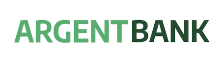

# Projet 11 - Formation OpenClassrooms - Argent Bank

Implémenter le front-end d'une application bancaire avec React

## Outils utilisés :

- React
- Redux-Toolkit
- TypeScript
- MongoDB
- Swagger
- Vite
- Node.JS

# Installation et lancement de l'API

1. Cloner le repository

   - `git clone https://github.com/NicolasOsborne/oc-projet-11.git`

2. Pré-requis

   Argent Bank utilise les stacks suivantes :

   - [Node.JS >= v12](https://nodejs.org/en/)
   - [MongoDB Community Server](https://www.mongodb.com/try/download/community)

   Veuillez vérifier que vous avez les bonnes versions des deux packages. Pour vérifier, utilisez les commandes suivantes dans le terminal :

```bash
   # Check Node.js version
   node --version

   # Check Mongo version
   mongo --version
```

3. Installation

   Ouvrir un termninal dans le projet cloné et lancer les commandes suivantes :

```bash
# Install dependencies
npm install

# Start local dev server
npm run dev:server

# Populate database with two users
npm run populate-db
```

Votre serveur devrait maintenant être lancé sur le port http://localhost:3001 et avoir les 2 users suivants renseignés dans la base de données MongoDB :

### Tony Stark

- First Name: `Tony`
- Last Name: `Stark`
- Email: `tony@stark.com`
- Password: `password123`

### Steve Rogers

- First Name: `Steve`,
- Last Name: `Rogers`,
- Email: `steve@rogers.com`,
- Password: `password456`

## Documentation de l'API

Vous pouvez consulter la documentation Swagger de l'API à l'adresse suivante : http://localhost:3001/api-docs

4. Lancement de l'application

   - Ouvrir une nouvelle fenêtre de terminal
   - `cd frontend`
   - `npm install`
   - `npm run dev`

5. Ouvrir le projet à l'URL suivante :

   - `http://localhost:5173/`

## Design Assets

Static HTML and CSS has been created for most of the site and is located in: `/designs`.

For some of the dynamic features, like toggling user editing, there is a mock-up for it in `/designs/wireframes/edit-user-name.png`.

And for the API model that you will be proposing for transactitons, the wireframe can be found in `/designs/wireframes/transactions.png`.
